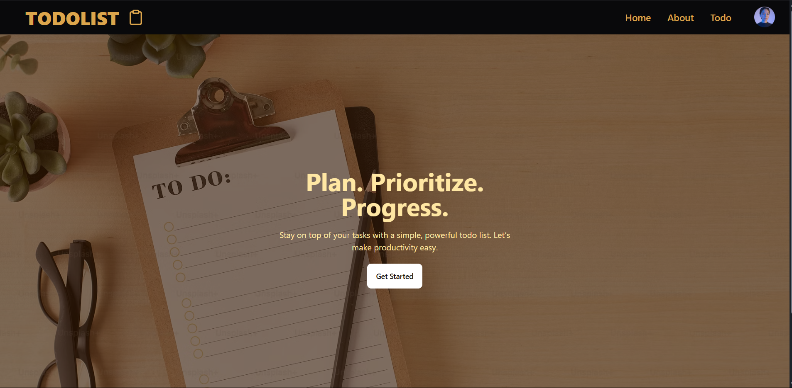
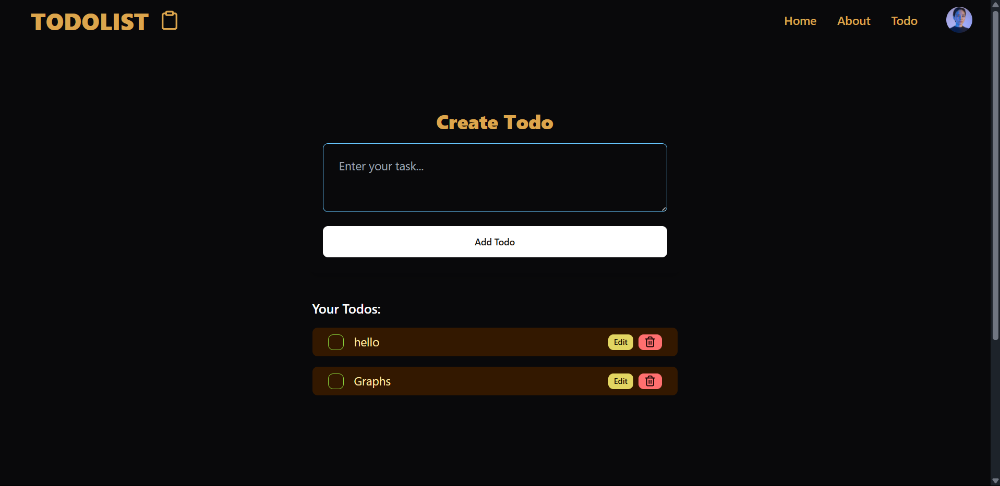
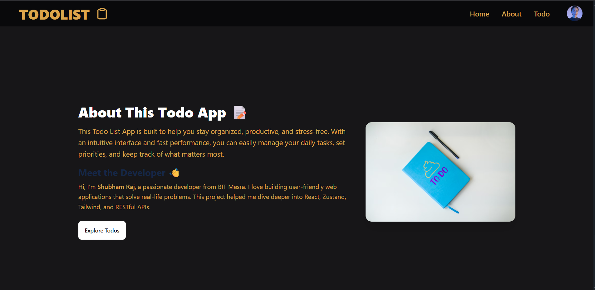

# 📝 TODOLIST App

A modern and responsive ToDoList application to manage your tasks efficiently. Built with **React.js**, styled using **Tailwind CSS** and **DaisyUI**, and backed by a **PostgreSQL API** for persistent storage.

---

## 🚀 Features

- ✏️ Add tasks  
- 🔁 Update existing tasks  
- 🗑️ Delete tasks  
- ➕ Append new tasks  
- ✅ Mark tasks complete  
- 🌗 Fully responsive UI with DaisyUI styling  

---

## 🛠 Tech Stack

- **Frontend**: React.js, Tailwind CSS, DaisyUI  
- **Backend**: PostgreSQL (via REST API)  

---

## 📷 Screenshots





## 🚀 Getting Started
 1. Clone the Repository
 ```
git clone https://github.com/shubhamraj2604/TODOLIST.git
cd TODOLIST/frontend
```
2. Install Dependencies
```
npm install
```
3. Run the App
```
npm run dev
```

## 🌐 Deployment
This project will be deployed soon to a live URL for public access. Stay tuned!


